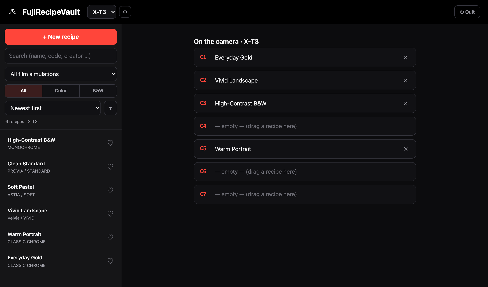
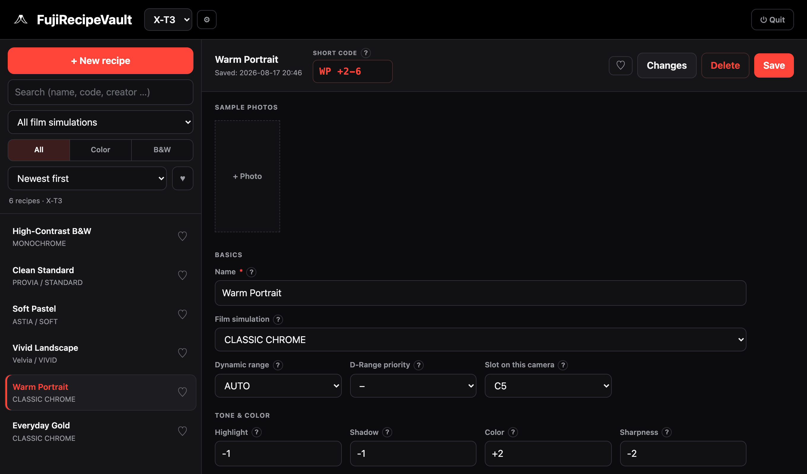
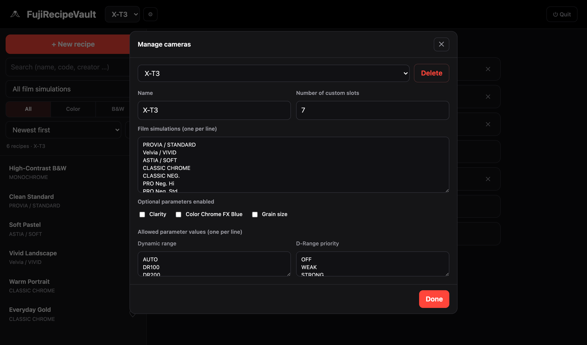

# FujiRecipeVault

FujiRecipeVault is a small app I built to keep my Fujifilm film-simulation recipes in one tidy
place. It began as a tool for my own **X-T3**, but it works just as happily with the newer bodies —
the X-T4, X-T5, X-Pro3, X100V and the rest of the family — because every film simulation, every
parameter and every allowed value can be adjusted to match the camera you actually shoot with.

If you build your own recipes, you already know the usual ways of keeping track of them, and neither
is much fun: a growing pile of screenshots that never quite look the same twice, or a slick app that
asks for money and hides everything behind an account. FujiRecipeVault is meant to be the calmer
option in between — a clean, consistent home for your recipes that runs entirely on your own
computer, with no account, no subscription and no cloud. Your data lives in plain files right next to
the app, and the whole interface is in English.



> **An independent project — not affiliated with Fujifilm.**
> FujiRecipeVault is an unofficial hobby project. It is not affiliated with, authorized, sponsored or
> endorsed by FUJIFILM Corporation. "Fujifilm", "Fujinon" and the camera model names (X-T3, X-T4, and
> so on) are trademarks of their respective owners and appear here only to describe compatibility
> (nominative use). The logo shows Mount Fuji, the mountain — it is not, and does not reproduce, any
> Fujifilm brand mark.

> **How it was made.**
> This application was "vibe-coded" — built conversationally with **Claude Code** using the
> **Opus 4.8** model — as a personal hobby project. It works well and keeps your data entirely on your
> own machine, but it is offered as-is, with no warranty (see the [license](LICENSE)).

---

## What it does

At its heart, FujiRecipeVault is a searchable library of your recipes. Expand any item for the
details:

<details>
<summary><b>A recipe library</b></summary>

Search, a filter by film simulation and by Color / B&W, sorting and favorites.

</details>

<details>
<summary><b>A full editor</b></summary>

Every setting a Fujifilm recipe can hold: film simulation, dynamic range, tone curves, color,
sharpness, grain, the Color Chrome effects, white balance with its red and blue shift, ISO, exposure
compensation and notes.

</details>

<details>
<summary><b>A short code</b></summary>

A code such as `KG +4-5` that records the white-balance shift, because the camera itself does not
store that per custom bank.

</details>

<details>
<summary><b>Per-parameter help</b></summary>

A small **?** beside each field explains what it does and whether your camera supports it.

</details>

<details>
<summary><b>Camera slots (C1–C7)</b></summary>

They mirror your custom banks; assign a recipe by dragging it onto a slot.

</details>

<details>
<summary><b>Several cameras side by side</b></summary>

Each with its own recipes, film simulations, parameters and slots — and a recipe can belong to more
than one.

</details>

<details>
<summary><b>A camera manager</b></summary>

Create cameras from a preset, rename them, edit their film simulations and the allowed values of
every parameter, toggle optional features (Clarity, Color Chrome FX Blue, Grain Size) and add
parameters of your own. This is exactly how the app grows from an X-T3 tool into something that fits
any Fujifilm body.

</details>

<details>
<summary><b>Example photos</b></summary>

Attach sample images per recipe, so you remember the look.

</details>

<details>
<summary><b>Original vs. changes</b></summary>

The app keeps the original when you edit, so you can see what changed, reset to it, or set the
current state as the new baseline.

</details>

<details>
<summary><b>Example recipes</b></summary>

Loaded with a single click, so a fresh install isn't empty.

</details>

<details>
<summary><b>A quiet background start</b></summary>

No terminal window; you stop it with the **Quit** button in the top-right corner.

</details>

---

## What you need

All you need is Python 3, which already comes with macOS and most Linux systems. On Windows you can
install it from [python.org](https://www.python.org/downloads/) — just remember to tick *"Add Python
to PATH"* during setup. There are no other dependencies at all, because the app uses only Python's
standard library.

---

## Installing and running

Download the project with the green **Code** button (choose **Download ZIP** and unzip it) or clone
the repository, then put the folder wherever you like. How you start it depends on your system —
expand yours:

<details>
<summary><b>macOS</b></summary>

Double-click **`FujiRecipeVault starten.command`**. The server starts in the background, your browser
opens, and the terminal window closes itself. The very first time, macOS may refuse to open a file
downloaded from the internet; if so, right-click the launcher, choose **Open**, and confirm with
**Open** once. You will not be asked again.

</details>

<details>
<summary><b>Windows</b></summary>

Double-click **`FujiRecipeVault starten (Windows).vbs`**, which starts everything without a console
window. If nothing seems to happen, Python is most likely missing: install it from
[python.org](https://www.python.org/downloads/) with *"Add Python to PATH"* ticked, or run
`python app.py` in a terminal opened in the folder.

</details>

<details>
<summary><b>Linux</b></summary>

Make the launcher executable once with `chmod +x "FujiRecipeVault starten (Linux).sh"` and run it, or
start the app from a terminal with `python3 app.py`.

</details>

On any system, you can also start it by hand:

```bash
cd path/to/this/folder
python3 app.py
```

Then open <http://127.0.0.1:8765>. You stop the app with the **⏻ Quit** button in the top right, or
by pressing `Ctrl + C` in the terminal if one is open.

---

## Putting it on your desktop

The launcher can live anywhere, but it is convenient to start the app straight from your desktop with
a proper icon. Expand your system:

<details>
<summary><b>macOS (with Automator)</b></summary>

macOS does not follow shortcuts to a `.command` file very gracefully, so the tidiest approach is a
tiny Automator application that simply runs the launcher.

1. Open **Automator** (in your Applications folder) and create a new document of the type
   **Application**.
2. Search for **Run Shell Script** and drag it into the workflow area on the right.
3. Replace the sample text with a single line that opens the launcher, using the real path to your
   folder — for example: `open "/Users/you/path/to/FujiRecipeVault/FujiRecipeVault starten.command"`
4. Choose **File → Save**, name it *FujiRecipeVault*, and save it onto your **Desktop**.
5. To give it the real icon, open **`ICON.png`** in Preview and copy it (**Edit → Select All**, then
   **Edit → Copy**). Select your new desktop app, press **⌘ I** for **Get Info**, click the small
   icon in the top-left corner of that window, and paste with **⌘ V**.

From then on, double-clicking the desktop icon starts FujiRecipeVault like any other app.

</details>

<details>
<summary><b>Windows</b></summary>

Right-click **`FujiRecipeVault starten (Windows).vbs`** and choose **Send to → Desktop (create
shortcut)**. A shortcut appears on your desktop, which you can rename to *FujiRecipeVault*. If you
would also like the mountain icon on it, you need an `.ico` version of the image: right-click the
shortcut, open **Properties**, click **Change Icon**, and point it at that `.ico` file.

</details>

<details>
<summary><b>Linux</b></summary>

Most desktops let you place a small `.desktop` file on the desktop. Create a file called
`FujiRecipeVault.desktop` on your Desktop with the following content, adjusting both paths to your own
folder:

```ini
[Desktop Entry]
Type=Application
Name=FujiRecipeVault
Exec=bash "/home/you/path/to/FujiRecipeVault/FujiRecipeVault starten (Linux).sh"
Icon=/home/you/path/to/FujiRecipeVault/ICON.png
Terminal=false
```

Then mark it as executable (`chmod +x ~/Desktop/FujiRecipeVault.desktop`); some file managers instead
ask you to right-click and choose *"Allow launching"* the first time.

</details>

---

## Quick start

1. Choose your camera in the selector at the top left, or add one through the **⚙ gear** button.
2. On a fresh install the library is empty — click **Load example recipes** to see a few in action,
   or press **+ New recipe** to start your own.
3. Fill in the settings and click **Save**.
4. Back on the main view (no recipe selected), the camera slots appear on the right; **drag a recipe
   from the list onto a slot** to record where it lives on the camera.
5. Click a recipe to open it for editing, and click it again to close it.

The complete, step-by-step walkthrough lives in **[docs/USER_GUIDE.md](docs/USER_GUIDE.md)**.

### The recipe editor


### The camera manager


---

## Your data stays with you

The app keeps everything in plain files inside its own folder:

| File | Contents |
|---|---|
| `recipes.csv` | All your recipes — you can open it in Numbers or Excel at any time. |
| `cameras.json` | Your cameras, their capabilities and slot assignments. |
| `images/` | Your example photos. |

These files are yours and never leave your machine. They are deliberately excluded from the Git
repository (see `.gitignore`), so a fresh clone of this project starts empty, with an empty library
and a single default camera. Nothing you enter is ever uploaded anywhere.

Because the data is local, you look after the backups yourself, which is as simple as copying the
files somewhere safe:

```bash
cp recipes.csv cameras.json /path/to/backup/
cp -R images /path/to/backup/
```

Keeping a copy of the whole app folder in your own private backup or file sync works just as well.

---

## If something goes wrong

<details>
<summary><b>Nothing happens when I double-click the launcher.</b></summary>

Python is probably not installed (most common on Windows). Install it from
[python.org](https://www.python.org/downloads/), tick *"Add Python to PATH"* on Windows, and try
again — or run `python app.py` (Windows) or `python3 app.py` (macOS/Linux) from a terminal opened in
the folder.

</details>

<details>
<summary><b>macOS says the file "cannot be opened".</b></summary>

That is the standard Gatekeeper prompt for downloaded files. Right-click the launcher, choose
**Open**, and confirm with **Open** — only needed once.

</details>

<details>
<summary><b>The browser does not open by itself.</b></summary>

Open it manually and go to <http://127.0.0.1:8765>.

</details>

<details>
<summary><b>It says the address is already in use.</b></summary>

FujiRecipeVault is probably already running, so just open <http://127.0.0.1:8765>. To force a stuck
instance to stop on macOS or Linux, run `lsof -ti tcp:8765 | xargs kill -9`.

</details>

<details>
<summary><b>A setting isn't shown for my camera.</b></summary>

The editor only shows the parameters your selected camera supports. You can add or change them under
**⚙ gear → camera → parameters**.

</details>

---

## Frequently asked

<details>
<summary><b>Can the app write recipes onto the camera?</b></summary>

No, this doesn't work.

</details>

<details>
<summary><b>The model tables aren't perfect.</b></summary>

They are best-effort defaults. You can edit any camera's film simulations, parameters and allowed
values in the gear dialog to match your body exactly.

</details>

<details>
<summary><b>Where do the example recipes come from?</b></summary>

They are generic, illustrative starter recipes bundled with the app (in the `examples/` folder).
Treat them as a starting point: tweak them, or delete them and add your own.

</details>

---

## License

FujiRecipeVault is released under the **MIT License** — see [LICENSE](LICENSE). You may use, modify
and share it freely, and it comes with no warranty.
